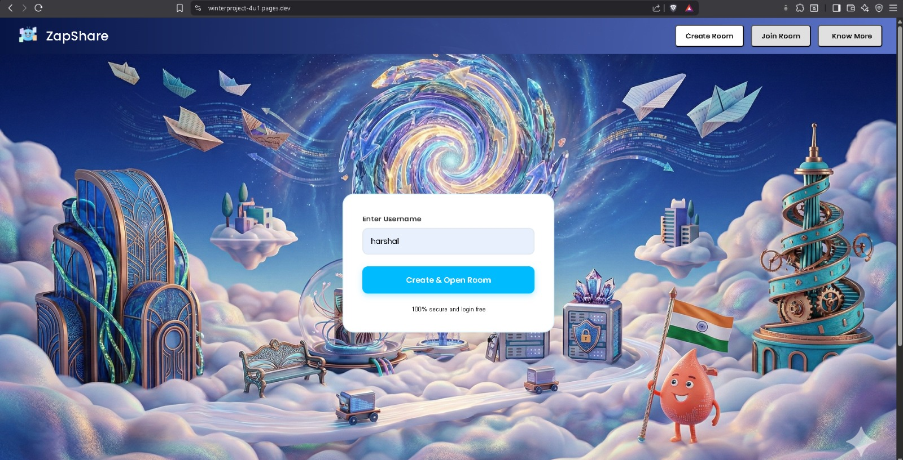
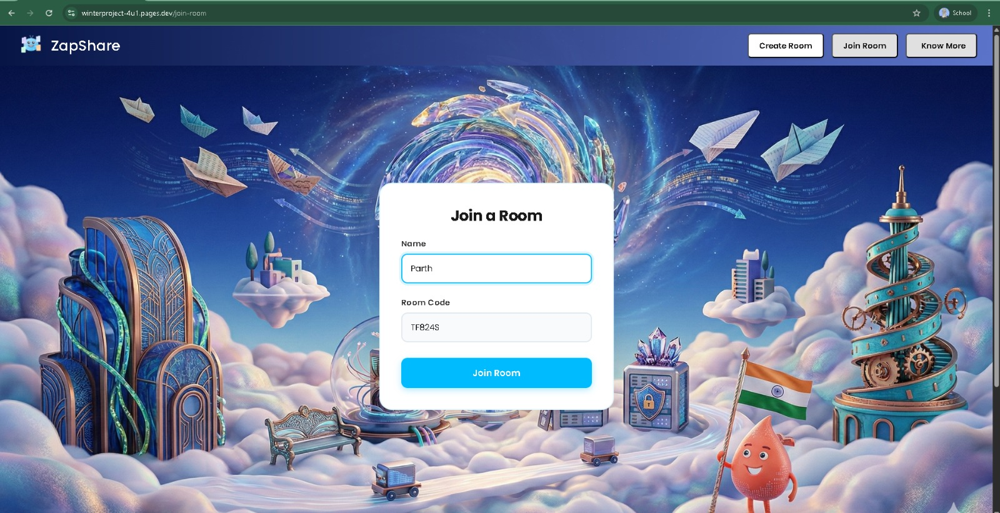
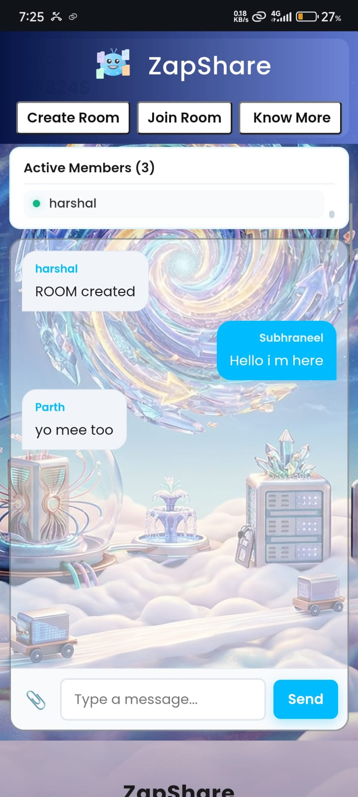
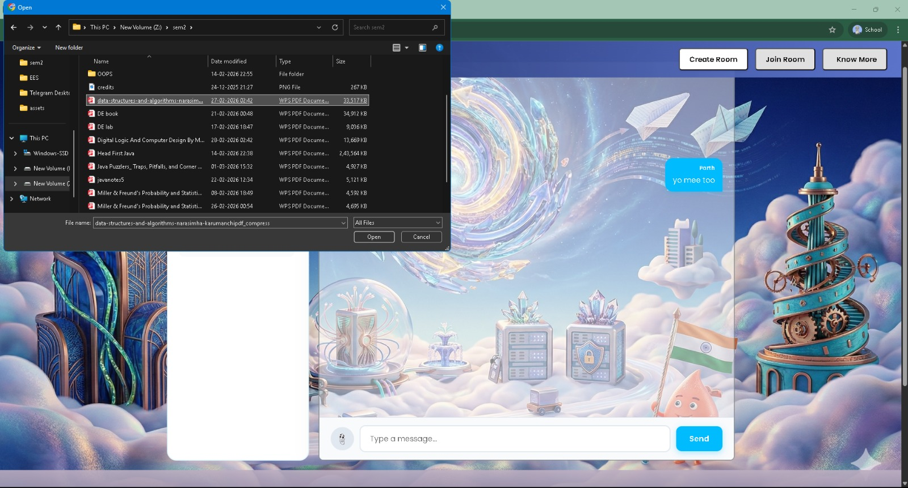
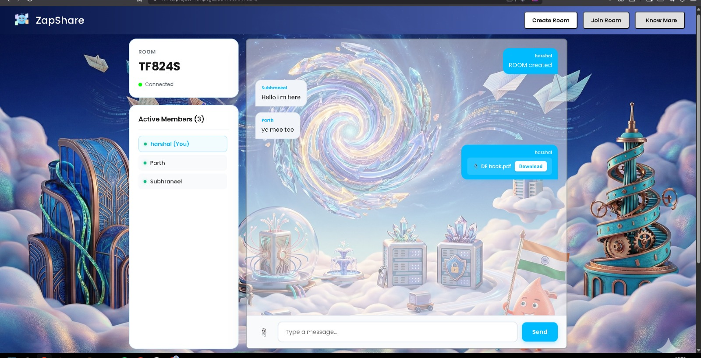
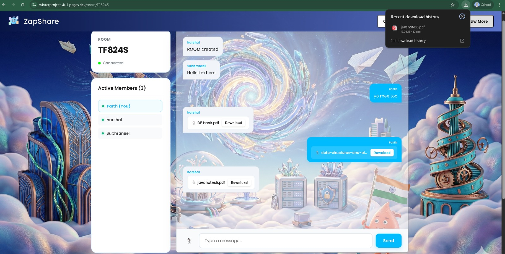

# 🔗 P2P Chatting Website

## 👥 Team Members
- Parth Goyal
- Harshal Sachan
- Shubraneel Paul

## 📝 Brief Description
A peer-to-peer (P2P) chatting platform that enables secure, decentralized communication between users. The system supports real-time messaging, file sharing, and uses data compression algorithms to efficiently break down files into smaller parts for transfer via GunJS. The goal is to provide a privacy-focused, serverless communication tool that is lightweight and scalable.

## 🖼️ Screenshots
  
  
  
  
  

## 🌐 Hosted URL
https://zapshare-aec.pages.dev/

## ✨ Features Implemented

### Frontend
- Modern UI built with React and Vite  
- Real-time chat interface with dynamic updates  
- File upload and sharing functionality  
- Responsive design for desktop and mobile  

### Backend
- Peer-to-peer networking using GunJS  
- Secure authentication with BCrypt  
- ExpressJS for routing and API endpoints  
- URL-parser for handling dynamic routes  
- Data compression algorithms to split files into smaller chunks for efficient transfer
- Paco for compression

## 🛠️ Tech Stack & Concepts Used
**Backend**  
- Node.js  
- Express.js  
- GunJS (decentralized database & networking)  
- BCrypt (password hashing)  
- URL-parser  

**Frontend**  
- React  
- Vite  

**Concepts**  
- Peer-to-peer networking  
- Decentralized storage and communication  
- Data compression for file transfer  
- Secure authentication and routing  

## 💡 Thought Behind the Project
The project was inspired by the need for secure, decentralized communication without reliance on centralized servers. By leveraging GunJS, the system ensures resilience and privacy. Adding file sharing with compression algorithms makes the platform practical for everyday use, while keeping bandwidth usage efficient. The vision is to create a lightweight, scalable chat solution that empowers users to control their own data.
